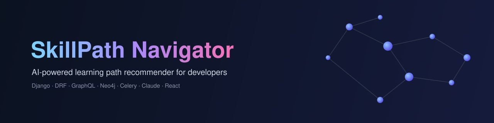

<div align="center">



# SkillPath Navigator

An LLM- and graph-powered learning path recommender for developers

[](https://github.com/deuteriumZzz/skillpath_navigator/actions/workflows/ci.yml)


**[Русский](README.md)** · **[English](README.en.md)**

</div>

Users describe their skills — including as free-form text, parsed by an LLM — and the system builds a dependency graph between skills, recommends the next steps, computes an optimal learning path, and points to where to find material (GitHub, YouTube, courses).

## Contents

- [Stack](#stack)
- [Architecture](#architecture)
- [Project structure](#project-structure)
- [Running locally](#running-locally)
- [Deploying to a remote server](#deploying-to-a-remote-server)
- [REST API](#rest-api)
- [GraphQL](#graphql)
- [WebSocket](#websocket)
- [Monitoring](#monitoring)
- [Tests and linting](#tests-and-linting)
- [CI/CD](#cicd)
- [Make commands](#make-commands)

---

## Stack

| Layer | Technology |
|---|---|
| Framework | Django 4.2, Django REST Framework 3.14 |
| Auth | JWT (simplejwt 5.3.1) + Argon2 + blacklist on rotation |
| API | REST (DRF) + GraphQL (graphene-django) |
| Real-time | Django Channels 4 + WebSocket |
| ASGI server | Gunicorn + Uvicorn workers |
| Skill graph | Neo4j 5 (prod) / networkx in-memory (dev/tests) |
| Database | PostgreSQL 15 / SQLite (dev/tests) |
| Cache | Redis 7 (django-redis) |
| Task queue | Celery 5 + Redis broker (async LLM analysis) |
| LLM | Anthropic Claude claude-sonnet-4-6 (with MCP support) |
| External APIs | GitHub, YouTube, Stepik, Coursera (mocked without keys) |
| Docs | drf-spectacular (OpenAPI 3.0 + Swagger UI) |
| Frontend | React 18 + Vite 5 + Tailwind CSS + vis-network |
| Proxy | nginx (reverse proxy + static files from a shared volume) |
| Monitoring | Prometheus + Grafana (dashboards) + Flower (Celery dashboard) |
| Logging | JSON logs in production (python-json-logger) |
| Error tracking | Sentry (optional, via `SENTRY_DSN`) |

---

## Architecture

```
Browser
  │
  ▼
┌─────────────────────────────────────┐
│  nginx (port 80 / 443)              │
│  /           → React SPA            │
│  /api/       → gunicorn :8000       │
│  /admin/     → gunicorn :8000       │
│  /graphql/   → gunicorn :8000       │
│  /ws/        → gunicorn :8000       │
│  /flower/    → flower :5555 (Basic Auth) │
│  /grafana/   → grafana :3000        │
│  /metrics    → Docker network only  │
│  /static/    → shared volume        │
└────────────────┬────────────────────┘
                 │
  ┌──────────────▼───────────────────────────────────┐
  │  Gunicorn + UvicornWorker (ASGI)                 │
  │  apps/api               — REST (health/ready)    │
  │  apps/skills/views.py   — skills + graph          │
  │  apps/progress/views.py — progress + paths        │
  │  apps/recommendations/  — LLM + Celery polling   │
  │  apps/resources/views.py — GitHub/YouTube/courses │
  │  apps/graphql_schema    — GraphQL                │
  │  apps/progress.consumers — WebSocket (Channels)  │
  └───────────┬────────────────────┬─────────────────┘
              │                    │
  ┌───────────▼──────┐  ┌─────────▼──────────────────┐
  │  PostgreSQL 15   │  │  Redis 7                   │
  │  (main DB)       │  │  cache + channel layer     │
  └──────────────────┘  │  Celery broker (DB 2)      │
              │          │  Celery results (DB 3)     │
  ┌───────────▼──────┐  └──────────┬─────────────────┘
  │  Neo4j 5         │             │
  │  (skill graph)   │  ┌──────────▼──────────────────┐
  │  --profile neo4j │  │  Celery Worker              │
  └──────────────────┘  │  analyze_skills_text_task   │
                         └─────────────────────────────┘

core/
  constants.py  — SKILL_LEVELS, RELATION_TYPES, cache keys
  middleware.py — JWTAuthMiddleware for WebSocket
  pagination.py — StandardPagination (20 / max 100)
  permissions.py — IsAdminOrReadOnly, IsOwnerOrAdmin
  throttles.py  — LoginRateThrottle (10/hour on /token/)
```

---

## Project structure

```
skillpath_navigator/
├── .github/workflows/ci.yml      # test → lint → mypy → docker-build → publish
├── .pre-commit-config.yaml       # black, isort, flake8
├── Makefile
├── docker-compose.yml
├── monitoring/
│   ├── prometheus.yml            # scrape config (Django /metrics, 15s)
│   └── grafana/
│       ├── provisioning/
│       │   ├── datasources/      # Prometheus datasource (auto)
│       │   └── dashboards/       # dashboard provider (auto)
│       └── dashboards/
│           └── skillpath.json    # 6 panels: RPS, latency, DB, cache, errors
├── backend/
│   ├── Dockerfile
│   ├── entrypoint.sh             # migrate → collectstatic → superuser → seed → gunicorn
│   ├── pytest.ini                # coverage gate 60%
│   ├── config/
│   │   ├── settings.py
│   │   ├── celery.py             # Celery app init
│   │   └── urls.py
│   ├── core/
│   │   ├── constants.py
│   │   ├── middleware.py
│   │   ├── pagination.py
│   │   ├── permissions.py
│   │   └── throttles.py          # LoginRateThrottle
│   ├── apps/
│   │   ├── api/                  # urls.py + views.py (health/readiness)
│   │   ├── users/                # models, serializers, views, urls
│   │   ├── skills/                # models, views, signals, filters
│   │   ├── graph/                 # GraphService (Neo4j/networkx)
│   │   ├── progress/              # models, views, WebSocket consumers
│   │   ├── recommendations/       # LLM, Celery tasks, views
│   │   ├── resources/             # GitHub, YouTube, courses, views
│   │   └── graphql_schema/        # GraphQL schema
│   ├── tests/
│   │   ├── conftest.py
│   │   ├── factories.py          # UserFactory, SkillFactory, UserSkillFactory
│   │   ├── test_api.py
│   │   ├── test_tasks.py         # Celery tasks, rate-limit, concurrency
│   │   └── ...
│   ├── requirements.txt
│   ├── requirements-dev.txt
│   └── .env.example
└── frontend/
    ├── Dockerfile                # multi-stage: node build → nginx
    ├── nginx.conf                # reverse proxy + /metrics restricted to the network
    ├── package.json
    ├── vite.config.js
    └── src/
        ├── App.jsx               # JWT auto-refresh on 401 (via api.js)
        ├── api.js                # fetch + auto-refresh + Celery polling
        └── components/
            ├── Auth.jsx
            ├── Dashboard.jsx
            ├── SkillGraph.jsx    # vis-network graph
            ├── LearningPath.jsx
            ├── Resources.jsx
            └── Progress.jsx
```

---

## Running locally

### Requirements

- Python 3.11+
- Node.js 20+ and npm
- (optional) Docker + Docker Compose — for PostgreSQL, Redis, Neo4j

### Option A — fully without Docker (SQLite + in-memory graph)

```bash
# 1. Clone the repository
git clone <url> skillpath_navigator
cd skillpath_navigator

# 2. Set up the backend environment
cd backend
python3 -m venv .venv
source .venv/bin/activate        # Windows: .venv\Scripts\activate
pip install -r requirements.txt

# 3. Copy and review .env
cp .env.example ../.env
# DB_NAME left empty → SQLite
# GRAPH_BACKEND=memory           → in-memory graph (no Neo4j needed)
# USE_REDIS_CACHE=false          → in-memory cache (no Redis needed)
# USE_MOCK_EXTERNAL_APIS=True    → mocks instead of real GitHub/YouTube API calls

# 4. Create the database and tables
python manage.py migrate

# 5. Create an admin user
python manage.py createsuperuser

# 6. Seed the skills catalog
python manage.py seed_skills

# 7. Run the backend
python manage.py runserver
# → http://localhost:8000/api/v1/
# → http://localhost:8000/admin/
# → http://localhost:8000/api/docs/   (Swagger UI)
```

```bash
# In a separate terminal — run the frontend
cd frontend
npm install
npm run dev
# → http://localhost:5173
```

> **Works out of the box, no keys required:**
> DB — SQLite, graph — in-memory, LLM — heuristic fallback, external APIs — mocked.

---

### Option B — backend with Docker (PostgreSQL + Redis), Django locally

```bash
# Bring up only the infrastructure
docker compose up postgres redis -d

# Configure .env
cat > .env << 'EOF'
SECRET_KEY=dev-secret-change-in-prod
DEBUG=True
ALLOWED_HOSTS=localhost,127.0.0.1

DB_NAME=skillpath_db
DB_USER=postgres
DB_PASSWORD=postgres
DB_HOST=localhost
DB_PORT=5432

REDIS_HOST=localhost
REDIS_PORT=6379
USE_REDIS_CACHE=True

GRAPH_BACKEND=memory
USE_MOCK_EXTERNAL_APIS=True
DJANGO_LOG_LEVEL=INFO
EOF

# Run the backend
cd backend
source .venv/bin/activate
python manage.py migrate
python manage.py createsuperuser
python manage.py seed_skills
python manage.py runserver

# In a separate terminal — Celery worker (for LLM tasks)
celery -A config worker --loglevel=info
```

---

### Environment variables (reference)

| Variable | Default | Description |
|---|---|---|
| `SECRET_KEY` | insecure dev key | Must be changed in production |
| `DEBUG` | `True` | `False` in production |
| `ALLOWED_HOSTS` | `localhost,127.0.0.1` | Comma-separated server domains |
| `DB_NAME` | _(empty → SQLite)_ | PostgreSQL database name |
| `DB_USER` | `postgres` | PostgreSQL user |
| `DB_PASSWORD` | `postgres` | PostgreSQL password |
| `DB_HOST` | `localhost` | PostgreSQL host |
| `DB_CONN_MAX_AGE` | `60` | DB connection pool age (seconds) |
| `GRAPH_BACKEND` | `memory` | `memory` or `neo4j` |
| `NEO4J_URI` | `bolt://localhost:7687` | Neo4j address |
| `NEO4J_PASSWORD` | `password` | Neo4j password |
| `REDIS_HOST` | `localhost` | Redis host |
| `USE_REDIS_CACHE` | `True` | `false` for tests without Redis |
| `ANTHROPIC_API_KEY` | _(empty)_ | Claude API key |
| `ANTHROPIC_MODEL` | `claude-sonnet-4-6` | Claude model |
| `LLM_THROTTLE_RATE_PER_HOUR` | `10` | LLM request limit per user |
| `GITHUB_TOKEN` | _(empty)_ | GitHub API token |
| `YOUTUBE_API_KEY` | _(empty)_ | YouTube Data API key |
| `STEPIK_TOKEN` | _(empty)_ | Stepik API token |
| `USE_MOCK_EXTERNAL_APIS` | `True` | Mocks instead of real APIs |
| `SENTRY_DSN` | _(empty)_ | Sentry DSN (error tracking) |
| `SENTRY_TRACES_SAMPLE_RATE` | `0.1` | Sentry trace sampling rate |
| `SUPERUSER_USERNAME` | _(empty)_ | Superuser login for CI |
| `SUPERUSER_EMAIL` | _(empty)_ | Superuser email |
| `SUPERUSER_PASSWORD` | _(empty)_ | Superuser password |
| `GUNICORN_WORKERS` | `2` | Number of gunicorn workers |
| `DJANGO_LOG_LEVEL` | `INFO` | Logging level |
| `FLOWER_USER` | `flower` | Flower dashboard login |
| `FLOWER_PASSWORD` | `changeme` | Flower dashboard password |
| `GF_ADMIN_USER` | `admin` | Grafana login |
| `GF_ADMIN_PASSWORD` | `changeme` | Grafana password |

---

## Deploying to a remote server

### Server requirements

- Ubuntu 22.04 / Debian 12
- Docker Engine 24+ and the Docker Compose plugin
- Open ports: **80** (HTTP), **443** (HTTPS, optional)
- At least 2 GB RAM (the Celery worker and Neo4j need memory)

### 1. Install Docker

```bash
curl -fsSL https://get.docker.com | sh
sudo usermod -aG docker $USER && newgrp docker
```

### 2. Clone and configure

```bash
git clone <url> skillpath_navigator
cd skillpath_navigator
cp backend/.env.example .env
nano .env
```

Minimal changes required for production:

```env
SECRET_KEY=<python -c "import secrets; print(secrets.token_hex(50))">
DEBUG=False
ALLOWED_HOSTS=your-server-ip,yourdomain.com

DB_NAME=skillpath_db
DB_PASSWORD=<strong password>
USE_REDIS_CACHE=true
GRAPH_BACKEND=memory

SUPERUSER_USERNAME=admin
SUPERUSER_EMAIL=admin@yourdomain.com
SUPERUSER_PASSWORD=<strong password>

FLOWER_USER=flower
FLOWER_PASSWORD=<strong password>
GF_ADMIN_USER=admin
GF_ADMIN_PASSWORD=<strong password>
```

### 3. Start

```bash
docker compose up --build -d
```

On first run, `entrypoint.sh` automatically runs migrate, collectstatic, create_superuser, and seed_skills.

Once it's up:
- **Frontend:** `http://your-server-ip/`
- **Admin:** `http://your-server-ip/admin/`
- **API:** `http://your-server-ip/api/v1/`
- **Swagger:** `http://your-server-ip/api/docs/`
- **Flower:** `http://your-server-ip/flower/` (Celery monitoring, login required)
- **Grafana:** `http://your-server-ip/grafana/` (Django metrics, login from `.env`)

### 4. HTTPS with Let's Encrypt

```bash
sudo apt install -y certbot
docker compose down
sudo certbot certonly --standalone -d yourdomain.com
```

Add to `frontend/nginx.conf`:

```nginx
server {
    listen 443 ssl;
    server_name yourdomain.com;
    ssl_certificate     /etc/letsencrypt/live/yourdomain.com/fullchain.pem;
    ssl_certificate_key /etc/letsencrypt/live/yourdomain.com/privkey.pem;
    # ... rest of the config
}
server {
    listen 80;
    server_name yourdomain.com;
    return 301 https://$host$request_uri;
}
```

### 5. Useful commands

```bash
docker compose logs -f backend
docker compose logs -f celery_worker
docker compose exec backend python manage.py migrate
git pull && docker compose up --build -d
docker compose down      # stop
docker compose down -v   # stop + remove data (careful!)
```

---

## REST API

All endpoints require `Authorization: Bearer <access_token>`, except `/health/`, `/ready/`, and the auth endpoints.

### Authentication

| Method | URL | Description |
|---|---|---|
| POST | `/api/v1/auth/register/` | Register (`username`, `email`, `password`) |
| POST | `/api/v1/auth/token/` | Get a JWT (`access` + `refresh`). Rate limit: 10/hour |
| POST | `/api/v1/auth/token/refresh/` | Refresh the access token (refresh is rotated and invalidated) |

### Skills

| Method | URL | Access | Description |
|---|---|---|---|
| GET | `/api/v1/skills/` | anyone | List (pagination, filters) |
| GET | `/api/v1/skills/<id>/` | anyone | Skill details |
| POST | `/api/v1/skills/` | admin | Create a skill |
| PUT/PATCH | `/api/v1/skills/<id>/` | admin | Update a skill |
| DELETE | `/api/v1/skills/<id>/` | admin | Delete a skill |
| GET | `/api/v1/skills/graph/` | anyone | Graph (nodes + edges), 5 min cache |
| GET | `/api/v1/skills/<id>/next-step/` | anyone | Recommended next skills |
| GET | `/api/v1/skills/<from>/path-to/<to>/` | anyone | Shortest learning path |
| GET | `/api/v1/skills/<id>/resources/` | anyone | Materials (GitHub, YouTube, courses) |
| POST | `/api/v1/skills/from-text/` | anyone | LLM parsing (async, 10/hour limit) → `{task_id}` |

### Progress and learning

| Method | URL | Description |
|---|---|---|
| POST | `/api/v1/progress/update/` | Update progress (`skill_id`, `completion_percent`) |
| POST | `/api/v1/learning-path/` | Build a plan from `target_skills` (max 10) |
| GET | `/api/v1/users/<id>/path/` | Skills and progress (own data or admin only) |

### Tasks (Celery)

| Method | URL | Description |
|---|---|---|
| GET | `/api/v1/tasks/<task_id>/` | Task status: `{state, result}` |

`state`: `PENDING` → `STARTED` → `SUCCESS` / `FAILURE`

The frontend automatically polls this endpoint every 2 seconds (up to 30 attempts) after `POST /skills/from-text/`.

### Utility

| Method | URL | Description |
|---|---|---|
| GET | `/api/v1/health/` | Liveness probe — `{"status": "ok"}` |
| GET | `/api/v1/ready/` | Readiness probe — checks DB and Redis |
| GET | `/metrics` | Prometheus metrics (Docker network only) |
| GET | `/api/schema/` | OpenAPI 3.0 schema |
| GET | `/api/docs/` | Swagger UI |

---

## GraphQL

**Endpoint:** `/graphql/`
**Auth:** `Authorization: Bearer <access_token>` (required)
**GraphiQL:** only when `DEBUG=True`

```graphql
# Queries
users { id username email }
skills { id name level tags isVerified }
skillGraph { nodes { id name level } edges { from to type } }
nextSkills(userId: Int!) { skill level reason }
learningPath(startSkill: String!, endSkill: String!) { path distance levels }
githubRepos(skillName: String!) { name url stars }
youtubeVideos(skillName: String!) { title url }
courses(skillName: String!) { title url platform }

# Mutations
createSkill(name: String!, description: String, level: String, tags: [String])
addSkillDependency(skill: String!, dependsOn: String!, relationType: String)
ingestSkillsFromText(text: String!)
updateProgress(skillName: String!, completionPercent: Int!)
```

---

## WebSocket

**URL:** `ws://<host>/ws/progress/<user_id>/?token=<access_token>`

Close codes: `4001` — invalid token, `4003` — someone else's channel.

**Server event** (after each `POST /api/v1/progress/update/`):
```json
{ "skill": "Django", "completion_percent": 75 }
```

---

## Monitoring

### Flower — Celery Dashboard

Available at `http://localhost/flower/` (via nginx, requires HTTP Basic Auth).

Shows active tasks, queues, execution history, and worker status.

Port 5555 is not exposed externally — Flower is only reachable through the nginx proxy. The login is set via `.env`:

```env
FLOWER_USER=flower
FLOWER_PASSWORD=your-strong-password
```

```bash
# Run via docker compose (enabled by default)
docker compose up flower -d

# Or locally (no auth, dev only)
celery -A config flower --port=5555
```

### Grafana — dashboards

Available at `http://localhost/grafana/` (or `http://your-server-ip/grafana/`). The login is set via `.env`:

```env
GF_ADMIN_USER=admin
GF_ADMIN_PASSWORD=your-strong-password
```

On first run, the **SkillPath Navigator** dashboard is provisioned automatically with 6 panels:

| Panel | Metric |
|---|---|
| Request Rate | HTTP requests by method (req/s) |
| Response Status Codes | Responses by status code (req/s) |
| P95 Latency by View | 95th percentile response time by view |
| DB Query Rate | Database queries (queries/s) |
| Cache Hit Rate | Redis cache hit percentage |
| Error Rate | 4xx + 5xx requests per second |

Prometheus scrape interval — 15 seconds. Data is retained for 15 days (`prometheus_data` volume).

### Prometheus

Prometheus runs inside the Docker network (`prometheus:9090`) and scrapes Django's `/metrics` every 15 seconds. Port 9090 is not exposed externally — access is only through Grafana.

### Sentry

Set `SENTRY_DSN` in `.env` — Django, Celery, and Redis errors will automatically be reported to Sentry with performance traces.

---

## Tests and linting

```bash
# Run tests with coverage (60% gate)
make test

# Check style
make lint

# Format code
make fmt

# Install pre-commit hooks
pip install pre-commit && pre-commit install
```

Test modules in `backend/tests/`:

| File | Covers |
|---|---|
| `conftest.py` | Pytest fixtures (in-memory cache, reset between tests) |
| `factories.py` | UserFactory, SkillFactory, UserSkillFactory |
| `test_api.py` | REST endpoints, progress, LLM parsing |
| `test_tasks.py` | Celery task status, rate limiting, concurrency (select_for_update) |
| `test_permissions.py` | Access control, pagination, filters |
| `test_graph.py` | GraphService, path algorithms, weighting |
| `test_recommendations.py` | RecommendationEngine |
| `test_graphql_schema.py` | GraphQL queries and mutations |
| `test_skills.py` | Skill, UserSkill models, signals |
| `test_users.py` | Registration, JWT auth |
| `test_progress.py` | UserSkillProgress, WebSocket broadcast |
| `test_resources.py` | GitHub, YouTube, courses (mocked) |

Coverage: **72%** (gate: 60%).

---

## CI/CD

GitHub Actions runs on push/PR to `main`.

| Job | When | What it does |
|---|---|---|
| `test` | push + PR | pytest + 60% coverage gate (SQLite, no external services) |
| `lint` | push + PR | black + isort + flake8 |
| `mypy` | push + PR | Type checking (`--explicit-package-bases`, migrations excluded) |
| `docker-build` | push + PR | Builds the backend and frontend images (no push) |
| `publish` | push to `main` only | Pushes to `ghcr.io/<repo>/backend:latest` and `frontend:latest` |

---

## Make commands

```bash
make dev         # docker compose up --build (foreground)
make prod        # docker compose up --build -d (background)
make test        # pytest + coverage
make lint        # black --check + isort --check + flake8
make fmt         # black + isort (auto-format)
make migrate     # python manage.py migrate
make shell       # python manage.py shell
make seed        # populate the DB from backend/data/skills.csv
make superuser   # create a superuser from .env
```
